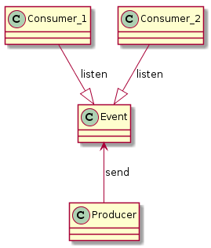
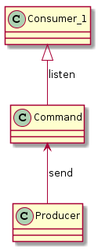
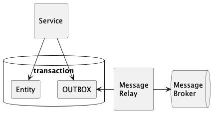
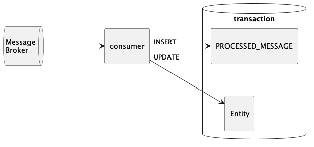
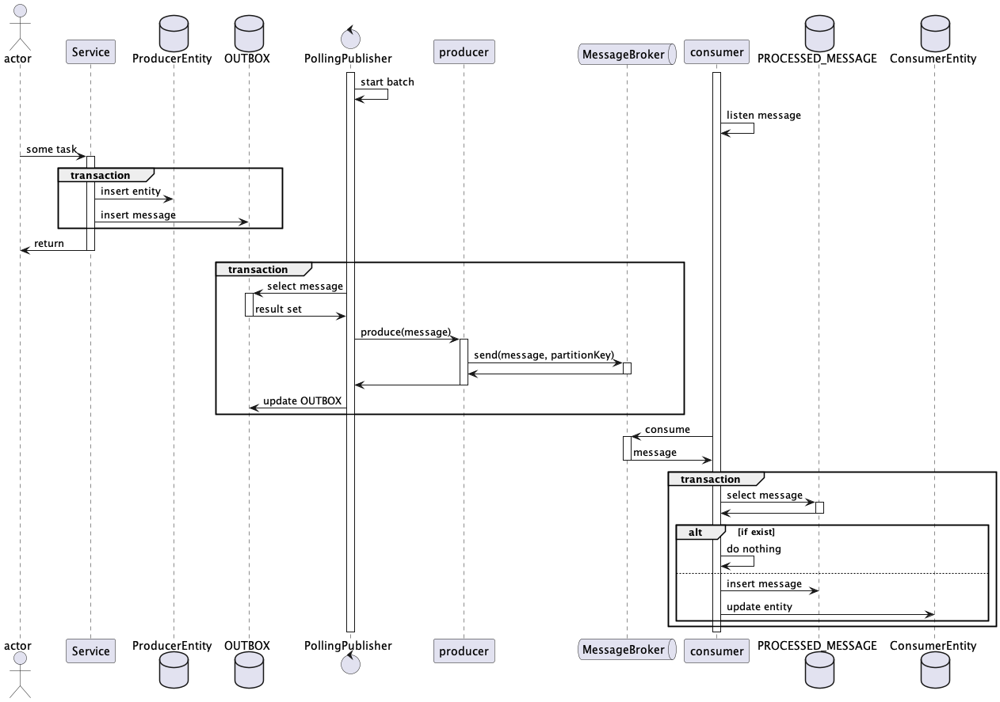

# Messaging

- 이벤트 메세지 또는 커맨드 메세지를 이용하여 상호간에 통신하는 방식

## 이벤트

- 이미 일어난 정보에 대한 메세지이다.
- immutable 하다.
- producer는 이벤트의 comsumer가 누구인지, 무엇을 하는지 모른다.
- ex)
  - 신규 물품이 입고되었을 때 필요한 시스템만 이벤트를 구독한다.
  - 신규 물품이 입고된 것은 이미 일어난 사건이다.

## 커맨드

- 수행할 작업에 대한 하나의 시스템에서 다른 시스템으로의 메세지
- 미래에 발생할 사건의 트리거가 된다.

## 메시징을 사용할 때 문제점

- 데이터 변경과 메세지 발행은 데이터베이스 트랜잭션 안에서 이루어진다.
- 메세지 발생에 사용하는 메세지 브로커는 데이터베이스 트랜잭션을 함께 사용할 수 없다.
- 데이터베이스에 데이터 변경은 성공했지만 메세지 발행에 실패하는 경우가 생긴다.
- 메세지 발행은 성공했지만 데이터베이스 반영은 실패하는 경우가 생긴다.

→ 서비스간 데이터 일관성이 깨진다.

## Transactional Outbox Pattern

- 메시징을 통해 데이터를 처리할 때 데이터의 일관성을 처리하기 위해 사용한다.
- 트랜잭션 커밋된 메세지는 적어도 한번(at least once) 메세지를 발행한다.
- 방법
  1. 서비스 트랜잭션에 OUTBOX 테이블을 추가하고, 메세지를 저장한다.
  2. 별도의 MessageRelay가 주기적으로 OUTBOX 테이블에 있는 메세지를 발행한다.
     - MessageRelay는 polling publisher 또는 transaction log miner로 구현할 수 있다.
       
- 데이터베이스 트랜잭션이 커밋된 경우에만 MessageRelay를 통해서 메세지를 발행한다.
- MessageRelay를 통하기 때문에 메세지 발행에 시차는 생기지만, Eventual Consistency를 유지한다.
- 하지만, MessageRelay 프로세스가 메세지 발행 중에 종료되는 등의 이유로 메세지 중복이 발생할 수 있다.

## 멱등 수신자 (Idempotent Receiver)

- 동일한 메세지를 중복으로 여러번 수신해도 문제가 발생하지 않는 수신자이다.
- 방법
  1. PROCESSED_MESSAGE 테이블을 추가한다.
  2. 메세지를 수신하면 식별자를 이용해서 테이블에서 조회한다.
  3. 테이블에서 조회된다면 메세지를 무시한다.
  4. 조회되지 않는 메세지면 PROCESSED_MESSAGE에 저장하고 처리한다.
  - (메세지 식별자에 unique 제약조건을 걸어서 구분할 수도 있다.)
    

## 전체 흐름

